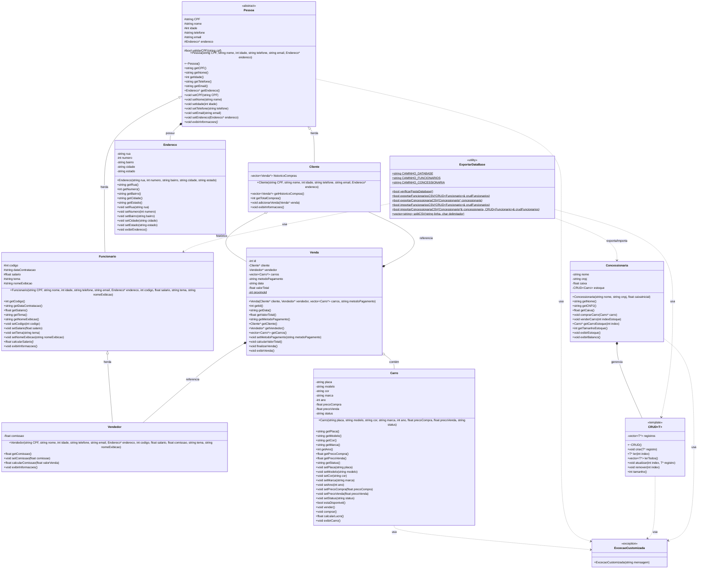

# Diagrama UML - Sistema de Loja de Carros

## Diagrama de Classes

## Descrição das Classes

### Classes de Domínio

#### **Pessoa** (Abstrata)
Classe base para representar pessoas no sistema. Contém atributos e métodos comuns a clientes e funcionários.

#### **Cliente**
Herda de Pessoa. Representa os clientes da concessionária e mantém histórico de compras.

#### **Funcionario**
Herda de Pessoa. Representa funcionários da concessionária com informações de contratação e salário.

#### **Vendedor**
Herda de Funcionario. Especialização de funcionário com sistema de comissões sobre vendas.

#### **Endereco**
Representa o endereço completo de uma pessoa (rua, número, bairro, cidade, estado).

#### **Carro**
Representa os veículos comercializados pela concessionária, com informações de placa, modelo, preços e status.

#### **Venda**
Registra as transações de venda, relacionando cliente, vendedor e carros vendidos, além de armazenar data e método de pagamento.

#### **Concessionaria**
Gerencia o negócio: estoque de carros, caixa financeiro, compra e venda de veículos.

### Classes Utilitárias

#### **CRUD\<T\>** (Template)
Classe genérica para operações CRUD (Create, Read, Update, Delete) sobre qualquer tipo de objeto.

#### **ExcecaoCustomizada**
Classe de exceção personalizada para tratamento de erros específicos do sistema.

#### **ExportarDataBase**
Classe utilitária para persistência de dados em arquivos CSV (funcionários e concessionária).

## Padrões de Projeto Utilizados

1. **Template Method**: Classe CRUD genérica
2. **Inheritance/Polymorphism**: Hierarquia Pessoa → Cliente/Funcionario → Vendedor
3. **Singleton Pattern**: Uso de atributo estático proximoId em Venda
4. **Repository Pattern**: CRUD como repositório genérico

## Relacionamentos Principais

- **Herança**: Cliente e Funcionario herdam de Pessoa; Vendedor herda de Funcionario
- **Composição**: Pessoa possui Endereco (composição forte)
- **Agregação**: Cliente tem histórico de Vendas; Venda referencia Cliente, Vendedor e Carros
- **Uso**: Concessionaria gerencia CRUD de Carros
- **Dependência**: Classes lançam ExcecaoCustomizada quando necessário
