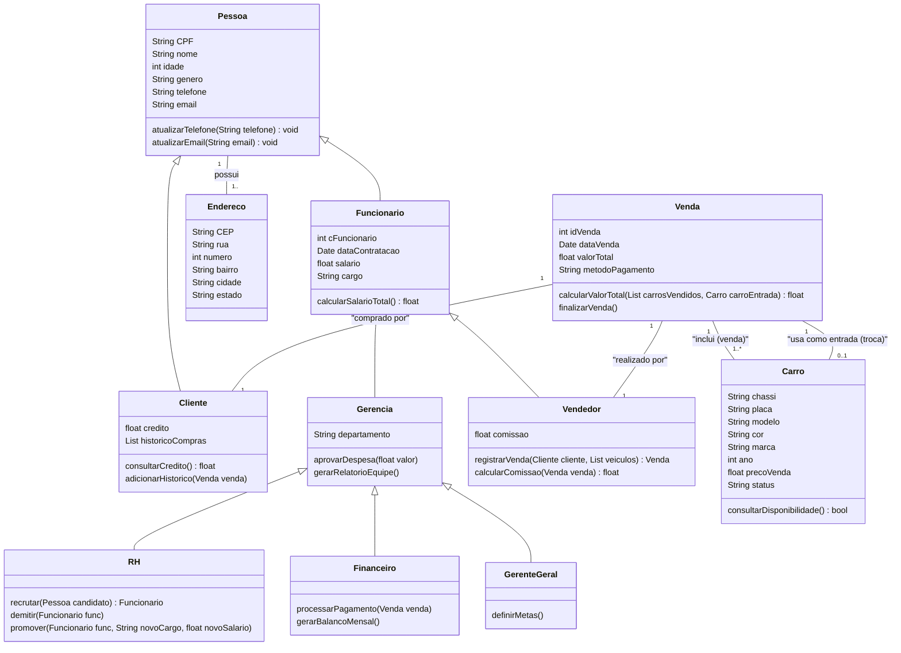

```mermaid
classDiagram
    Pessoa <|-- Funcionario
    Pessoa <|-- Cliente
    Funcionario <|-- Gerencia
    Funcionario <|-- Vendedor
    Gerencia <|-- RH
    Gerencia <|-- Financeiro
    Gerencia <|-- GerenteGeral

    Pessoa "1" -- "1.." Endereco : possui

    Venda "1" -- "1" Cliente : "comprado por"
    Venda "1" -- "1" Vendedor : "realizado por"
    Venda "1" -- "1..*" Carro : "inclui (venda)"
    Venda "1" -- "0..1" Carro : "usa como entrada (troca)"

    class Pessoa {
        String CPF
        String nome
        int idade
        String genero
        String telefone
        String email
        atualizarTelefone(String telefone) void
        atualizarEmail(String email) void
    }

    class Endereco {
        String CEP
        String rua
        int numero
        String bairro
        String cidade
        String estado
    }

    class Funcionario {
        int cFuncionario
        Date dataContratacao
        float salario
        String cargo
        calcularSalarioTotal() float
    }

    class Cliente {
        float credito
        List<Venda> historicoCompras
        consultarCredito() float
        adicionarHistorico(Venda venda)
    }

    class Gerencia {
        String departamento
        aprovarDespesa(float valor)
        gerarRelatorioEquipe()
    }

    class RH {
        recrutar(Pessoa candidato) Funcionario
        demitir(Funcionario func)
        promover(Funcionario func, String novoCargo, float novoSalario)
    }

    class GerenteGeral {
        definirMetas()
    }

    class Financeiro {
        processarPagamento(Venda venda)
        gerarBalancoMensal()
    }

    class Vendedor {
        float comissao
        registrarVenda(Cliente cliente, List<Carro> veiculos) Venda
        calcularComissao(Venda venda) float
    }

    class Carro {
        String chassi
        String placa
        String modelo
        String cor
        String marca
        int ano
        float precoVenda
        String status
        consultarDisponibilidade() bool
    }

    class Venda {
        int idVenda
        Date dataVenda
        float valorTotal
        String metodoPagamento
        calcularValorTotal(List<Carro> carrosVendidos, Carro carroEntrada) float
        finalizarVenda()
    }
```
