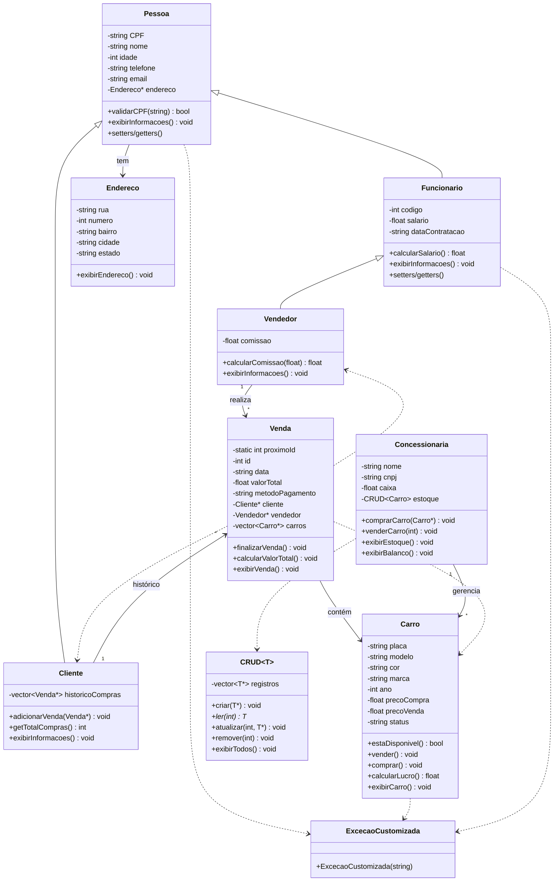

```mermaid
classDiagram
direction TB
    class Pessoa {
	    -string CPF
	    -string nome
	    -int idade
	    -string telefone
	    -string email
	    -Endereco* endereco
	    +validarCPF(string) bool
	    +exibirInformacoes() void
	    +setters/getters()
    }

    class Funcionario {
	    -int codigo
	    -float salario
	    -string dataContratacao
	    +calcularSalario() float
	    +exibirInformacoes() void
	    +setters/getters()
    }

    class Cliente {
	    -vector~Venda*~ historicoCompras
	    +adicionarVenda(Venda*) void
	    +getTotalCompras() int
	    +exibirInformacoes() void
    }

    class Vendedor {
	    -float comissao
	    +calcularComissao(float) float
	    +exibirInformacoes() void
    }

    class Venda {
	    -static int proximoId
	    -int id
	    -string data
	    -float valorTotal
	    -string metodoPagamento
	    -Cliente* cliente
	    -Vendedor* vendedor
	    -vector~Carro*~ carros
	    +finalizarVenda() void
	    +calcularValorTotal() void
	    +exibirVenda() void
    }

    class Carro {
	    -string placa
	    -string modelo
	    -string cor
	    -string marca
	    -int ano
	    -float precoCompra
	    -float precoVenda
	    -string status
	    +estaDisponivel() bool
	    +vender() void
	    +comprar() void
	    +calcularLucro() float
	    +exibirCarro() void
    }

    class Concessionaria {
	    -string nome
	    -string cnpj
	    -float caixa
	    -CRUD~Carro~ estoque
	    +comprarCarro(Carro*) void
	    +venderCarro(int) void
	    +exibirEstoque() void
	    +exibirBalanco() void
    }

    class Endereco {
	    -string rua
	    -int numero
	    -string bairro
	    -string cidade
	    -string estado
	    +exibirEndereco() void
    }

    class CRUD~T~ {
	    -vector~T*~ registros
	    +criar(T*) void
	    +ler(int) T*
	    +atualizar(int, T*) void
	    +remover(int) void
	    +exibirTodos() void
    }

    class ExcecaoCustomizada {
	    +ExcecaoCustomizada(string)
    }

    Pessoa <|-- Funcionario
    Pessoa <|-- Cliente
    Funcionario <|-- Vendedor
    Cliente "1" --> "*" Venda : histórico
    Vendedor "1" --> "*" Venda : realiza
    Venda "" --> "" Carro : contém
    Concessionaria "1" --> "*" Carro : gerencia
    Pessoa --> Endereco : tem
    Concessionaria ..> CRUD
    Venda ..> Cliente
    Venda ..> Vendedor
    Venda ..> Carro
    Pessoa ..> ExcecaoCustomizada
    Carro ..> ExcecaoCustomizada
    Funcionario ..> ExcecaoCustomizada
```
