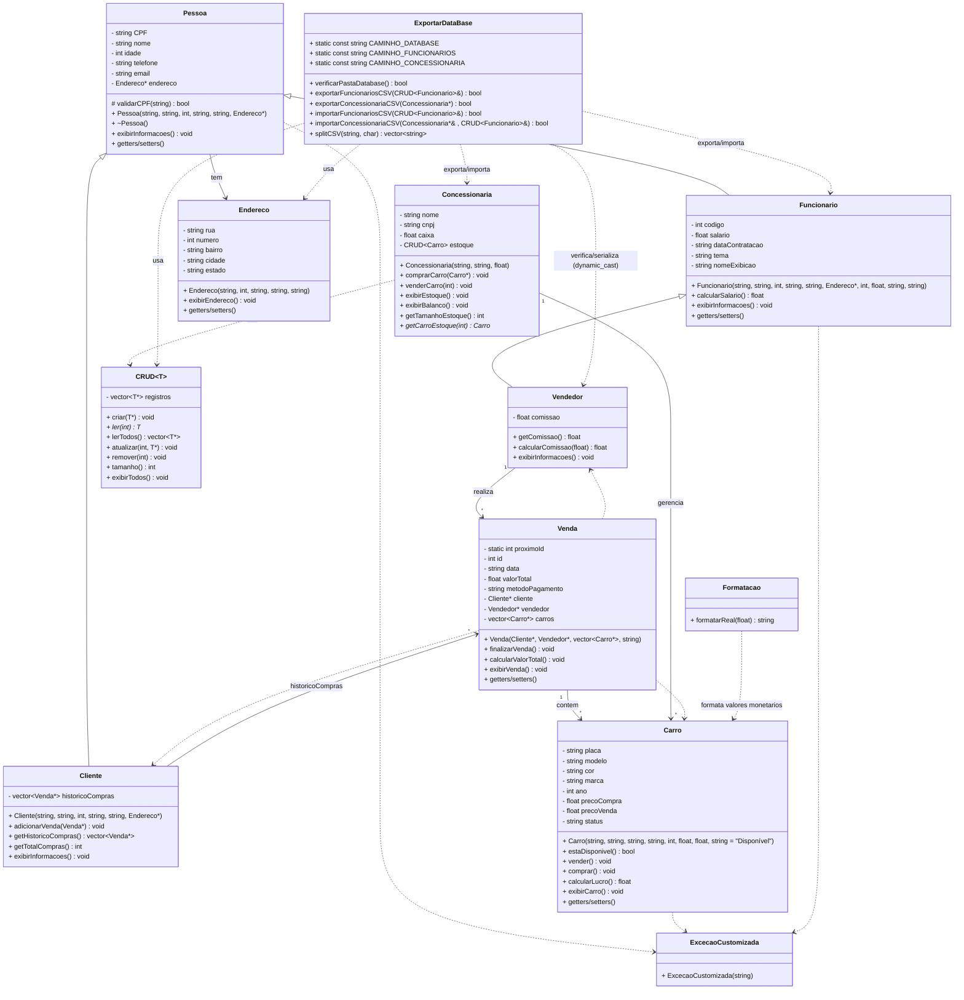

```mermaid
classDiagram
direction TB

    class Pessoa {
        - string CPF
        - string nome
        - int idade
        - string telefone
        - string email
        - Endereco* endereco
        # validarCPF(string) bool
        + Pessoa(string, string, int, string, string, Endereco*)
        + ~Pessoa()
        + exibirInformacoes() void
        + getters/setters()
    }

    class Funcionario {
        - int codigo
        - float salario
        - string dataContratacao
        - string tema
        - string nomeExibicao
        + Funcionario(string, string, int, string, string, Endereco*, int, float, string, string)
        + calcularSalario() float
        + exibirInformacoes() void
        + getters/setters()
    }

    class Vendedor {
        - float comissao
        + getComissao() float
        + calcularComissao(float) float
        + exibirInformacoes() void
    }

    class Cliente {
        - vector~Venda*~ historicoCompras
        + Cliente(string, string, int, string, string, Endereco*)
        + adicionarVenda(Venda*) void
        + getHistoricoCompras() vector~Venda*~
        + getTotalCompras() int
        + exibirInformacoes() void
    }

    class Venda {
        - static int proximoId
        - int id
        - string data
        - float valorTotal
        - string metodoPagamento
        - Cliente* cliente
        - Vendedor* vendedor
        - vector~Carro*~ carros
        + Venda(Cliente*, Vendedor*, vector~Carro*~, string)
        + finalizarVenda() void
        + calcularValorTotal() void
        + exibirVenda() void
        + getters/setters()
    }

    class Carro {
        - string placa
        - string modelo
        - string cor
        - string marca
        - int ano
        - float precoCompra
        - float precoVenda
        - string status
        + Carro(string, string, string, string, int, float, float, string = "Disponível")
        + estaDisponivel() bool
        + vender() void
        + comprar() void
        + calcularLucro() float
        + exibirCarro() void
        + getters/setters()
    }

    class Concessionaria {
        - string nome
        - string cnpj
        - float caixa
        - CRUD~Carro~ estoque
        + Concessionaria(string, string, float)
        + comprarCarro(Carro*) void
        + venderCarro(int) void
        + exibirEstoque() void
        + exibirBalanco() void
        + getTamanhoEstoque() int
        + getCarroEstoque(int) Carro*
    }

    class Endereco {
        - string rua
        - int numero
        - string bairro
        - string cidade
        - string estado
        + Endereco(string, int, string, string, string)
        + exibirEndereco() void
        + getters/setters()
    }

    class CRUD~T~ {
        - vector~T*~ registros
        + criar(T*) void
        + ler(int) T*
        + lerTodos() vector~T*~
        + atualizar(int, T*) void
        + remover(int) void
        + tamanho() int
        + exibirTodos() void
    }

    class ExcecaoCustomizada {
        + ExcecaoCustomizada(string)
    }

    class ExportarDataBase {
        + static const string CAMINHO_DATABASE
        + static const string CAMINHO_FUNCIONARIOS
        + static const string CAMINHO_CONCESSIONARIA
        + verificarPastaDatabase() bool
        + exportarFuncionariosCSV(CRUD~Funcionario~&) bool
        + exportarConcessionariaCSV(Concessionaria*) bool
        + importarFuncionariosCSV(CRUD~Funcionario~&) bool
        + importarConcessionariaCSV(Concessionaria*& , CRUD~Funcionario~&) bool
        + splitCSV(string, char) vector~string~
    }

    class Formatacao {
        + formatarReal(float) string
    }

    %% Relações
    Pessoa <|-- Funcionario
    Pessoa <|-- Cliente
    Funcionario <|-- Vendedor
    Cliente "1" --> "*" Venda : historicoCompras
    Vendedor "1" --> "*" Venda : realiza
    Venda "1" --> "*" Carro : contem
    Concessionaria "1" --> "*" Carro : gerencia
    Pessoa --> Endereco : tem
    Concessionaria ..> CRUD : usa
    ExportarDataBase ..> CRUD : usa
    ExportarDataBase ..> Concessionaria : exporta/importa
    ExportarDataBase ..> Funcionario : exporta/importa
    ExportarDataBase ..> Endereco : usa
    ExportarDataBase ..> Vendedor : verifica/serializa (dynamic_cast)
    Venda ..> Cliente
    Venda ..> Vendedor
    Venda ..> Carro
    Pessoa ..> ExcecaoCustomizada
    Carro ..> ExcecaoCustomizada
    Funcionario ..> ExcecaoCustomizada
    Formatacao ..> Carro : formata valores monetarios
```
